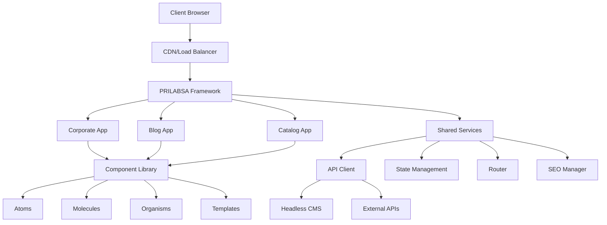

# PRILABSA Framework - Architecture Documentation

**Developed by [Solaria Agency](https://solaria.agency)**  
**Version:** 1.0.0  
**Last Updated:** January 2025  

---

## Overview

PRILABSA Framework is a modern, modular web development framework built by [Solaria Agency](https://solaria.agency) for creating scalable, multi-client applications. The architecture emphasizes modularity, performance, and developer experience while providing a consistent foundation for deploying multiple client applications across subdomains.

## Architecture Principles

### 1. Modular Design
- **Independent Applications**: Each app (corporate, blog, catalog) operates independently
- **Shared Components**: Common UI components across all applications
- **Isolated Dependencies**: App-specific dependencies don't affect others
- **Scalable Structure**: Easy to add new applications or modify existing ones

### 2. Performance First
- **Code Splitting**: Automatic route-based and component-based splitting
- **Lazy Loading**: Dynamic imports for non-critical components
- **Bundle Optimization**: Tree shaking and dead code elimination
- **Core Web Vitals**: Built-in optimization for LCP, FID, and CLS

### 3. Developer Experience
- **TypeScript Integration**: Full type safety across the framework
- **Hot Module Replacement**: Fast development with instant updates
- **Comprehensive Tooling**: Linting, testing, and build optimization
- **Documentation**: Extensive guides and API documentation

### 4. Client Customization
- **Theme System**: Consistent design tokens and customization
- **Configuration**: Environment-based settings and feature flags
- **Content Management**: Headless CMS integration for dynamic content
- **Deployment Flexibility**: Multiple hosting platform support

---

## System Architecture



---

## Directory Structure

```
PRILABSA-FRAMEWORK/
├── src/
│   ├── apps/                     # Application modules
│   │   ├── corporate/           # Corporate website
│   │   │   ├── components/      # App-specific components
│   │   │   ├── pages/          # App pages
│   │   │   ├── hooks/          # App-specific hooks
│   │   │   └── index.tsx       # App entry point
│   │   ├── blog/               # Blog platform
│   │   │   ├── components/
│   │   │   ├── pages/
│   │   │   ├── hooks/
│   │   │   └── index.tsx
│   │   └── catalog/            # E-commerce catalog
│   │       ├── components/
│   │       ├── pages/
│   │       ├── hooks/
│   │       └── index.tsx
│   ├── components/             # Shared component library
│   │   ├── atoms/              # Basic UI elements
│   │   │   ├── Button/
│   │   │   ├── Input/
│   │   │   ├── Text/
│   │   │   └── index.ts
│   │   ├── molecules/          # Component combinations
│   │   │   ├── SearchBox/
│   │   │   ├── Card/
│   │   │   └── index.ts
│   │   ├── organisms/          # Complex UI sections
│   │   │   ├── Header/
│   │   │   ├── Footer/
│   │   │   └── index.ts
│   │   ├── pages/              # Full page components
│   │   └── templates/          # Page layouts
│   ├── config/                 # Framework configuration
│   │   ├── framework.config.ts # Main configuration
│   │   ├── theme.config.ts     # Theme settings
│   │   └── routes.config.ts    # Routing configuration
│   ├── contexts/               # React contexts
│   │   ├── ThemeContext.tsx
│   │   ├── ConfigContext.tsx
│   │   └── index.ts
│   ├── hooks/                  # Custom React hooks
│   │   ├── useApi.ts
│   │   ├── useTheme.ts
│   │   ├── useSEO.ts
│   │   └── index.ts
│   ├── services/               # External service integrations
│   │   ├── api/               # API clients
│   │   ├── cms/               # CMS integrations
│   │   ├── analytics/         # Analytics services
│   │   └── seo/               # SEO utilities
│   ├── types/                  # TypeScript definitions
│   │   ├── index.ts           # Global types
│   │   ├── api.types.ts       # API types
│   │   └── cms.types.ts       # CMS types
│   ├── utils/                  # Utility functions
│   │   ├── cn.ts              # Class name utility
│   │   ├── format.ts          # Formatting utilities
│   │   ├── validation.ts      # Form validation
│   │   └── index.ts
│   ├── assets/                 # Static assets
│   │   ├── fonts/
│   │   ├── icons/
│   │   └── images/
│   ├── locales/               # Internationalization
│   │   ├── en/
│   │   ├── es/
│   │   └── index.ts
│   ├── App.tsx                # Main application component
│   ├── main.tsx               # Application entry point
│   └── index.css              # Global styles
├── docs/                       # Documentation
│   ├── ARCHITECTURE.md
│   ├── IMPLEMENTATION.md
│   ├── PRD.md
│   └── COMPONENTS.md
├── tests/                      # Test suites
│   ├── e2e/                   # End-to-end tests
│   ├── integration/           # Integration tests
│   └── unit/                  # Unit tests
├── public/                     # Public assets
├── package.json               # Dependencies and scripts
├── vite.config.ts            # Vite configuration
├── tailwind.config.js        # TailwindCSS configuration
├── tsconfig.json             # TypeScript configuration
└── README.md                 # Project documentation
```

---

## Component Architecture

### Atomic Design Methodology

The component library follows Atomic Design principles, organizing components into hierarchical levels:

#### Atoms (Basic Building Blocks)
```typescript
// Example: Button component
import { cva, type VariantProps } from 'class-variance-authority';

const buttonVariants = cva(
  "inline-flex items-center justify-center font-medium transition-all",
  {
    variants: {
      variant: {
        primary: "bg-brand-primary text-white hover:bg-blue-700",
        secondary: "bg-gray-100 text-gray-900 hover:bg-gray-200",
      },
      size: {
        sm: "px-3 py-1.5 text-xs",
        md: "px-4 py-2 text-sm",
        lg: "px-6 py-3 text-base",
      },
    },
    defaultVariants: {
      variant: "primary",
      size: "md",
    },
  }
);

export interface ButtonProps
  extends React.ButtonHTMLAttributes<HTMLButtonElement>,
    VariantProps<typeof buttonVariants> {
  loading?: boolean;
}

export const Button = ({ className, variant, size, ...props }) => {
  return (
    <button
      className={cn(buttonVariants({ variant, size }), className)}
      {...props}
    />
  );
};
```

#### Molecules (Component Combinations)
```typescript
// Example: SearchBox component
export const SearchBox = ({ placeholder, onSearch, ...props }) => {
  return (
    <div className="relative">
      <Input
        type="search"
        placeholder={placeholder}
        className="pl-10"
        {...props}
      />
      <Icon
        name="search"
        className="absolute left-3 top-1/2 transform -translate-y-1/2"
      />
    </div>
  );
};
```

#### Organisms (Complex UI Sections)
```typescript
// Example: Header component
export const Header = ({ navigation, logo, actions }) => {
  return (
    <header className="bg-white shadow-sm">
      <nav className="container mx-auto px-4">
        <div className="flex items-center justify-between h-16">
          <Logo src={logo} />
          <Navigation items={navigation} />
          <div className="flex items-center space-x-4">
            {actions}
          </div>
        </div>
      </nav>
    </header>
  );
};
```

---

## Application Modules

### 1. Corporate Application

**Purpose**: Professional corporate website  
**Route**: `/`  
**Subdomain**: `client.com`

**Components**:
- Homepage with hero section and services
- About page with team profiles
- Services showcase
- Contact forms and information
- Case studies and testimonials

**Key Features**:
- SEO optimization for business keywords
- Contact form with validation
- Team member profiles
- Service showcase with filtering
- Responsive design for all devices

### 2. Blog Application

**Purpose**: Content marketing and thought leadership  
**Route**: `/blog`  
**Subdomain**: `blog.client.com`

**Components**:
- Article listing with pagination
- Article detail pages
- Category and tag pages
- Author profile pages
- Search and filtering

**Key Features**:
- Headless CMS integration
- SEO optimization for content
- Social sharing capabilities
- RSS feed generation
- Comment system integration
- Reading time estimation

### 3. Catalog Application

**Purpose**: Product showcase and e-commerce  
**Route**: `/catalog`  
**Subdomain**: `shop.client.com`

**Components**:
- Product listing with filters
- Product detail pages
- Category navigation
- Search functionality
- Wishlist and cart features

**Key Features**:
- Advanced product filtering
- Search with autocomplete
- Product comparison
- Wishlist functionality
- Shopping cart integration
- Payment gateway support

---

## State Management

### React Query for Server State
```typescript
// API query example
export const useProducts = (filters?: ProductFilters) => {
  return useQuery({
    queryKey: ['products', filters],
    queryFn: () => api.products.getAll(filters),
    staleTime: 5 * 60 * 1000, // 5 minutes
    cacheTime: 10 * 60 * 1000, // 10 minutes
  });
};
```

### React Context for Client State
```typescript
// Theme context example
const ThemeContext = createContext<ThemeContextValue | undefined>(undefined);

export const ThemeProvider = ({ children }) => {
  const [theme, setTheme] = useState<Theme>('light');
  
  const value = {
    theme,
    setTheme,
    toggleTheme: () => setTheme(prev => prev === 'light' ? 'dark' : 'light'),
  };
  
  return (
    <ThemeContext.Provider value={value}>
      {children}
    </ThemeContext.Provider>
  );
};
```

---

## Performance Optimization

### Code Splitting Strategy
```typescript
// Route-based code splitting
const Corporate = lazy(() => import('../apps/corporate'));
const Blog = lazy(() => import('../apps/blog'));
const Catalog = lazy(() => import('../apps/catalog'));

// Component-based code splitting
const ProductGrid = lazy(() => import('../components/organisms/ProductGrid'));
```

### Bundle Analysis
- **Main Bundle**: Core React, Router, and essential utilities
- **App Bundles**: Each application loads independently
- **Component Bundles**: Large components load on demand
- **Vendor Bundles**: Third-party libraries separated

### Image Optimization
```typescript
// Responsive image component
export const OptimizedImage = ({ src, alt, sizes, ...props }) => {
  return (
    <picture>
      <source
        srcSet={generateWebPSrcSet(src)}
        type="image/webp"
        sizes={sizes}
      />
      
    </picture>
  );
};
```

---

## SEO Architecture

### Meta Management
```typescript
// SEO hook for page-level meta
export const useSEO = (meta: SEOMeta) => {
  const { title, description, keywords, image } = meta;
  
  return (
    <Helmet>
      <title>{title}</title>
      <meta name="description" content={description} />
      <meta name="keywords" content={keywords?.join(', ')} />
      <meta property="og:title" content={title} />
      <meta property="og:description" content={description} />
      <meta property="og:image" content={image} />
      <meta name="twitter:card" content="summary_large_image" />
    </Helmet>
  );
};
```

### Structured Data
```typescript
// JSON-LD structured data generation
export const generateStructuredData = (type: string, data: any) => {
  const structuredData = {
    '@context': 'https://schema.org',
    '@type': type,
    ...data,
  };
  
  return (
    <script
      type="application/ld+json"
      dangerouslySetInnerHTML={{ __html: JSON.stringify(structuredData) }}
    />
  );
};
```

---

## Security Architecture

### Content Security Policy
```typescript
// CSP configuration
const cspConfig = {
  defaultSrc: ["'self'"],
  scriptSrc: ["'self'", "'unsafe-inline'", "https://trusted-cdn.com"],
  styleSrc: ["'self'", "'unsafe-inline'", "https://fonts.googleapis.com"],
  imgSrc: ["'self'", "data:", "https:"],
  fontSrc: ["'self'", "https://fonts.gstatic.com"],
  connectSrc: ["'self'", "https://api.client.com"],
};
```

### Input Sanitization
```typescript
// Form validation and sanitization
export const sanitizeInput = (input: string): string => {
  return DOMPurify.sanitize(input, {
    ALLOWED_TAGS: [],
    ALLOWED_ATTR: [],
  });
};
```

---

## Testing Strategy

### Unit Testing
```typescript
// Component testing example
describe('Button Component', () => {
  it('renders with correct variant styles', () => {
    render(<Button variant="primary">Click me</Button>);
    expect(screen.getByRole('button')).toHaveClass('bg-brand-primary');
  });
  
  it('handles click events', () => {
    const handleClick = jest.fn();
    render(<Button onClick={handleClick}>Click me</Button>);
    fireEvent.click(screen.getByRole('button'));
    expect(handleClick).toHaveBeenCalledTimes(1);
  });
});
```

### Integration Testing
```typescript
// API integration testing
describe('Product API', () => {
  it('fetches products with filters', async () => {
    const filters = { category: 'electronics' };
    const products = await api.products.getAll(filters);
    expect(products).toHaveLength(10);
    expect(products[0]).toHaveProperty('id');
  });
});
```

### E2E Testing
```typescript
// Cypress E2E test example
describe('Product Catalog', () => {
  it('allows users to filter products', () => {
    cy.visit('/catalog');
    cy.get('[data-testid="category-filter"]').select('Electronics');
    cy.get('[data-testid="product-card"]').should('have.length.greaterThan', 0);
    cy.get('[data-testid="product-card"]').first().should('contain', 'Electronics');
  });
});
```

---

## Deployment Architecture

### Subdomain Strategy
```
client.com           → Corporate App (main domain)
blog.client.com      → Blog App
shop.client.com      → Catalog App
api.client.com       → API Gateway
cdn.client.com       → Static Assets
```

### Build Process
```typescript
// Vite configuration for multi-app builds
export default defineConfig({
  build: {
    rollupOptions: {
      input: {
        main: 'src/main.tsx',
        corporate: 'src/apps/corporate/index.tsx',
        blog: 'src/apps/blog/index.tsx',
        catalog: 'src/apps/catalog/index.tsx',
      },
    },
  },
  define: {
    __APP_VERSION__: JSON.stringify(process.env.npm_package_version),
    __BUILD_TIME__: JSON.stringify(new Date().toISOString()),
  },
});
```

---

## Monitoring & Analytics

### Performance Monitoring
```typescript
// Core Web Vitals tracking
export const trackWebVitals = (metric: Metric) => {
  switch (metric.name) {
    case 'CLS':
    case 'FID':
    case 'FCP':
    case 'LCP':
    case 'TTFB':
      analytics.track('web_vital', {
        name: metric.name,
        value: metric.value,
        id: metric.id,
      });
      break;
  }
};
```

### Error Tracking
```typescript
// Global error boundary
export class ErrorBoundary extends Component {
  componentDidCatch(error: Error, errorInfo: ErrorInfo) {
    console.error('Application error:', error, errorInfo);
    
    // Report to error tracking service
    errorTracking.captureException(error, {
      contexts: {
        react: errorInfo,
      },
    });
  }
}
```

---

## Future Considerations

### Scalability Enhancements
- **Micro-frontends**: Further modularization for large teams
- **CDN Optimization**: Global content delivery optimization
- **Progressive Web App**: Offline functionality and app-like experience
- **Server-Side Rendering**: Next.js or Remix integration for better SEO

### Technology Updates
- **React 19**: Concurrent features and Suspense improvements
- **TypeScript 5.x**: Latest language features and performance
- **Vite 7.x**: Build tool optimizations and new features
- **TailwindCSS 4.x**: New architecture and performance improvements

---

**Documentation maintained by [Solaria Agency](https://solaria.agency)**  
**Last updated:** January 2025  
**Contact:** hello@solaria.agency

*© 2025 Solaria Agency. All rights reserved.* 